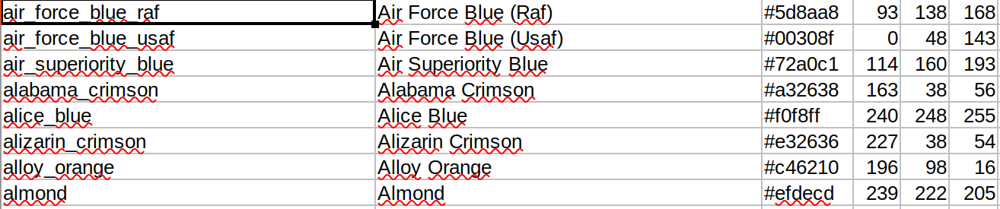
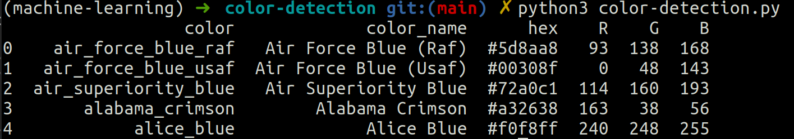

# Color Detection

1. [Importar librerías](#schema1)
2. [Tomar una imagen del usuario](#schema2)
3. [Leer el .csv](#shema3)
4. [Establecer un evento de devolución de llamada del mouse en una ventana](#schema4)
5. [Crea la función draw_function](#schema5)
6. [Obtener el color](#schema6)
7. [Leer la imagen con opencv](#schema7)
8. [Declaración de variables globales](#schema8)

# 1. Importar librerías
~~~python
import cv2
import numpy as np
import pandas as pd
import argparse

~~~

# 2. Tomar una imagen del usuario
Estamos usando la biblioteca `argparse` para crear un analizador de argumentos. Podemos dar directamente una ruta de imagen desde el símbolo del sistema.

~~~python
ap = argparse.ArgumentParser()
ap.add_argument('-i', '--image', required=True, help="Image Path")
args = vars(ap.parse_args())
img_path = args['image']
~~~

# 3. Leer el .csv
Con `pd.read_csv()` leemos el csv, como vemos no tiene ningún nombre en las columnas se lo vamos a asignar.

~~~python
index = ["color", "color_name", "hex", "R", "G", "B"]
data = pd.read_csv('./data/colors.csv', names = index, header = None)
~~~

# 4. Establecer un evento de devolución de llamada del mouse en una ventana
Primero, creamos una ventana en la que se mostrará la imagen de entrada. Luego, configuramos una función de devolución de llamada que se llamará cuando ocurra un evento de mouse.
~~~python
cv2.namedWindow('image')
cv2.setMouseCallback('image',draw_function)
~~~

# 5. Crea la función draw_function
Calculará los valores rgb del píxel en el que hacemos doble clic. Los parámetros de la función tienen el nombre del evento, las coordenadas (x, y) de la posición del mouse, etc. En la función, verificamos si se hace doble clic en el evento, luego calculamos y configuramos los valores r, g, b junto con x, y posiciones del ratón.

~~~python
def draw_function(event, x,y,flags,param):
    if event == cv2.EVENT_LBUTTONDBLCLK:
        global b,g,r,xpos,ypos, clicked
        clicked = True
        xpos = x
        ypos = y
        b,g,r = img[y,x]
        b = int(b)
        g = int(g)
        r = int(r)
~~~

# 6. Obtener el color

~~~python
def getColorName(R,G,B):
    minimun = 1000
    for i in range(len(data)):
        distance = abs(R -int(data.loc[i,"R"])) + abs(G -int(data.loc[i, "G"])) + abs(B- int(data.loc[i,"B"]))
        if distance <= minimum:
            minimun = distance
            colorName = data.loc[i,"color_name"]
    return colorName
~~~

# 7. Leer la imagen con opencv
~~~python
img = cv2.imread(img_path)
~~~

# 8. Declaración de variables globales
~~~python
clicked = False
r = g = b = xpos = ypos = 0
~~~

(https://data-flair.training/blogs/project-in-python-colour-detection/)
(https://www.pyimagesearch.com/2014/06/02/opencv-load-image/)
(https://medium.com/@MeerAjaz/the-function-is-not-implemented-6804e9b38b06)